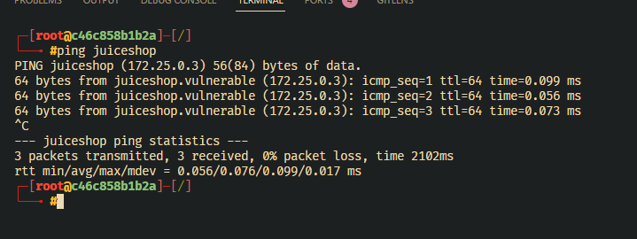

# Cybersecurity: Local Lab
This repo's objective is to focus all configurations for creating a local cybersecurity lab on you local machine.

It focus on creating `Docker containers and network` to create an environment for testing.
---
# DISCLAIMER
While running the target containers, you PC is going to be very vulnerable to attacks. Its recommended to run this on a VM or a machine without internet connection.
---

## Requirements
- Docker

## Usage
The `attacker` container will fire up the targets. 
```
docker compose run attacker bash
```
After the images are pulled and the containers are up, it should enter in `attacker`'s bash.
You can use `ping` or `curl` to check if the containers are up and running.



### `start` script
The `start` script was made to automate the process of starting and dropping the containers and network when the main `attacker` container is exitted.
It was designed for Linux systems, but can be adapted to other systems.

## Containers

We have three containers configured on this repo, plus a network for connection between them being isolated

- `attacker`: the attacker container, based on ParrotOS Image. This is the main workspace we will use for targeting the other containers
- `juiceshop`: [OWASP Juiceshop](https://owasp.org/www-project-juice-shop) vulnerable web app
- `webgoat`: [OWASP Webgoat](https://owasp.org/www-project-webgoat) vulnerable web app 
